 

<h2 align="left">Olá! 👋 Seja muito bem-vindo(a)!</h2>

###

  
  

###

Sou Erick Maicon, um Dev em formação que adora transformar desafios em código. Atualmente, estou focado em me aprofundar no mundo Backend com Java como parte do programa Devs do Agibank.  Pode ficar à vontade para explorar meus projetos e acompanhar a minha jornada de aprendizado. Vamos nessa!

###

 

  
  
  
  
  
  
  
  
  
  
  
  
  
  
  
  
  

###

  
  
  

###

  

###

###
